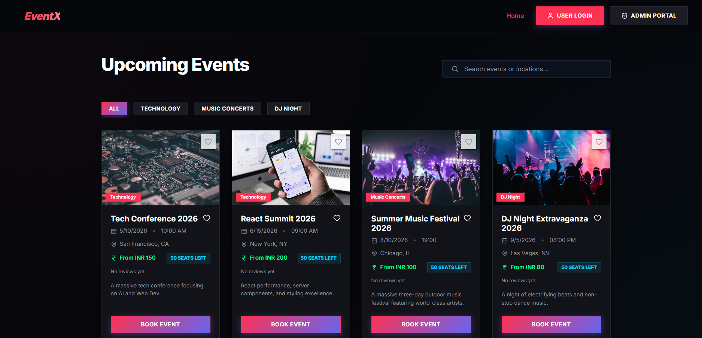
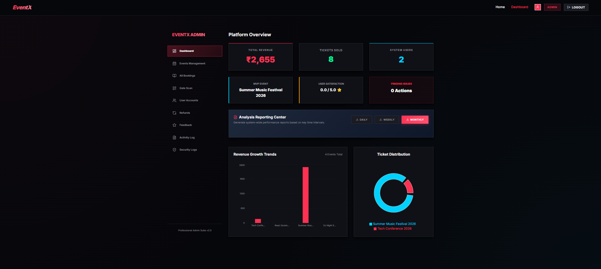
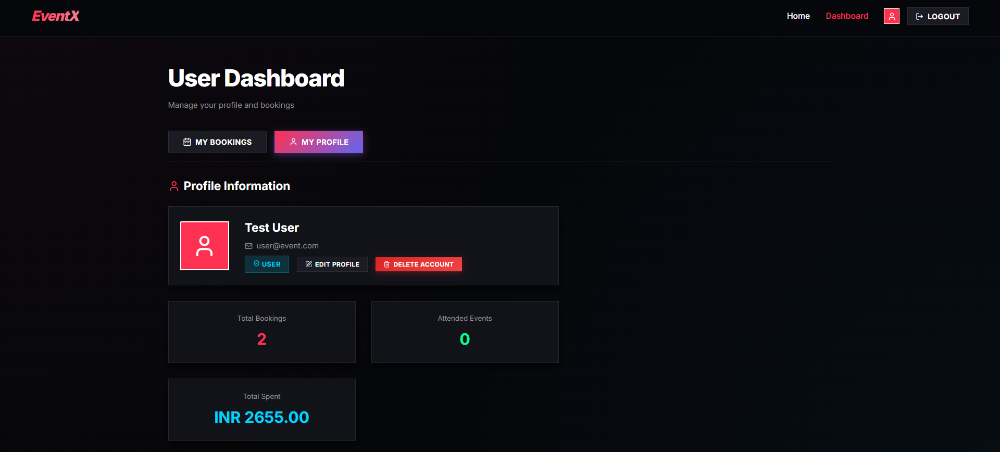

# EventX – Modern Online Event Management System


> A modern, responsive **event management platform** that allows users to explore and register for events while administrators manage events efficiently. Built using **React + Vite** for fast performance and a modern UI.

---

## 🌐 Live Demo

🔗 **Project Link:**
https://eventx-management-platform.netlify.app/

---

## 🚀 Features

* Fully responsive design (mobile, tablet, desktop)
* User and admin dashboards
* Secure authentication system
* Event creation and management by admins
* Event registration and booking for users
* Modern UI inspired by **Zomato / BookMyShow**
* Fast build and development using **Vite**
* Clean and intuitive user interface

---

## 🖥️ Tech Stack

**Frontend**

* React.js
* Vite
* CSS3 (Flexbox, Grid, Media Queries)

**Deployment**

* Netlify

**Tools**

* Git
* GitHub
* VS Code

---

## 📸 Screenshots

### 1) Explore Events (Home)



### 2) Admin Dashboard Overview



### 3) Admin Operations View


### 4) User Dashboard



### 5) Hero Section Preview


---

## 📱 Responsive Design

* Mobile-first UI approach
* Hamburger navigation menu
* Adaptive event cards
* Responsive forms and tables
* Optimized layouts for all screen sizes
* No horizontal scrolling

---

## 📁 Project Structure

```
eventx-management-platform
│
├── public
│
├── src
│   ├── assets
│   ├── components
│   ├── pages
│   ├── utils
│   ├── App.jsx
│   └── main.jsx
│
├── package.json
├── vite.config.js
└── README.md
```

---

## 🛠️ Getting Started

### 1️⃣ Clone the repository

```bash
git clone https://github.com/parthikrishh/online-event-management-system.git
cd online-event-management-system
```

### 2️⃣ Install dependencies

```bash
npm install
```

### 3️⃣ Run the development server

```bash
npm run dev
```

### 4️⃣ Build for production

```bash
npm run build
```

---

## 📦 Deployment

This project is deployed using **Netlify**.

Steps:

1. Build the project

```bash
npm run build
```

2. Upload the **dist** folder to Netlify.

Or connect your **GitHub repository directly to Netlify** for automatic deployments.

### Real-time multi-user deployment (recommended)

If you want 100+ users to see shared updates in near real-time:

1. Host frontend on Netlify.
2. Host backend separately (Render/Railway/Fly/VM) so `backend/server.js` is always running.
3. Set frontend env var on Netlify:

```bash
VITE_API_BASE_URL=https://your-backend-domain.com
```

4. Keep backend CORS enabled (already configured).

The frontend subscribes to backend SSE at `/api/stream`, and all data writes broadcast updates to connected clients.

## ✅ Quick Deploy (Copy This)

If you are not sure how to deploy, use this exact flow:

1. Push this repo to GitHub.
2. Deploy backend on Render:
	- New -> Web Service -> connect this repo
	- Render auto-detects `render.yaml`
	- Wait until service is live
	- Copy backend URL (example: `https://eventx-api.onrender.com`)
3. Deploy frontend on Netlify:
	- New site from Git -> connect same repo
	- Netlify auto-detects `netlify.toml`
	- In Site Settings -> Environment Variables, add:
	  - `VITE_API_BASE_URL` = your backend URL
	- Trigger redeploy
4. Verify:
	- Backend health: `https://your-backend-domain/api/health`
	- Frontend opens and logs in
	- Open two browsers and create/update a booking in one browser; the other should refresh automatically.

---

## 🙌 Credits

* Inspired by modern event booking platforms like **Zomato** and **BookMyShow**
* Built with ❤️ using **React + Vite**

---

## 👨‍💻 Author

**Parthiban K B**

* GitHub: https://github.com/parthikrishh
* Linkedin: www.linkedin.com/in/parthikrishh

---

⭐ If you like this project, feel free to **star the repository**.
